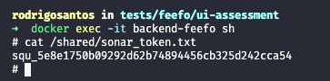

# Feefo: 1. Object Orientated Programming Assessment

## Overview

Provided with a list of ideal (normalized) job titles, the process returns the best match for a specific job entered.

### Backend
- Java with Spring Boot for business logic, data persistence, and communication with external services.
- PostgreSQL database for storing data of job titles.
- Migrations were utilized for database schema management and version control.

### Additional Tools
- **Swagger for API endpoint documentation**

  <p align="center">
    
  </p>

- **SonarQube for static code analysis**
    ```
    user: feefo
    password: f33f0
    ```

  <p align="center">
    
  </p>


### Docker Integration
- Docker and Docker Compose are used to containerize and manage the entire application stack, providing easy setup and deployment.

  <p align="center">
    
  </p>


## Environment Setup

### Prerequisites
- Docker and Docker Compose installed
- Java 17 or higher

### Configuration Instructions

1. Clone the repository:

2. Navigate to the Docker folder:
    ```sh
    cd architecture/docker
    ```

3. Start Docker containers:
    ```sh
    docker-compose up -d
    ```

4. To obtain the SonarQube token for code analysis, access the `backend-feefo` container:
    ```sh
    docker exec -it backend-feefo sh
    ```
5. Once inside the container, navigate to the shared folder and retrieve the SonarQube token:

    ```
    cat /shared/sonar_token.txt
    ```

  <p align="center">
    
  </p>


6. You can also view the logs of the backend-feefo container using the Docker dashboard

  <p align="center">
    
  </p>


### Running from your desk

#### Backend Configuration

Before starting the backend, make sure to have the following environment variables configured:

    export DATABASE_HOSTNAME="localhost:5432"
    export DATABASE_NAME="feefo"
    export DATABASE_PASSWORD="f33f0"
    export DATABASE_USERNAME="postgres"
    export SONAR_HOST_URL="http://localhost:9000"
    export SONAR_PROJECT_KEY="feefo"
    export SONAR_TOKEN=<previously obtained sonar token>

#### Running SonarQube Code Analysis

Before running SonarQube code analysis, ensure you have configured the SonarQube variables in your 
environment, mentioned above and run the following command:

```sh
./gradlew runSonar
```

The runSonar task is set up to upload code analysis results to your SonarQube server, enabling continuous code quality monitoring.


#### Note:
Remember to stop the respective containers if they are running locally to avoid conflicts.


### Tools and Services

- **Swagger (API Documentation)**: http://localhost:8080/swagger-ui.html
- **SonarQube (Code Analysis)**: http://localhost:9000


