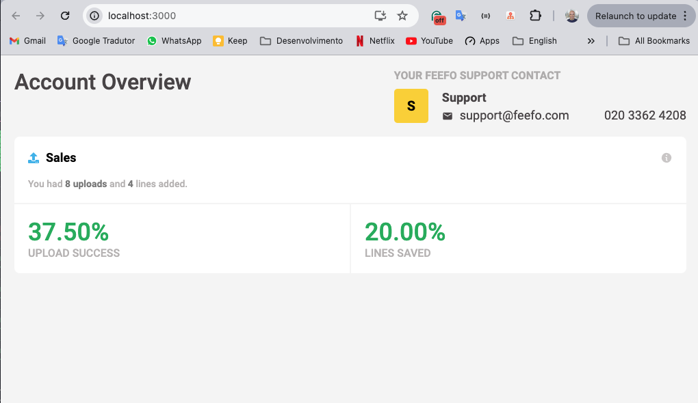
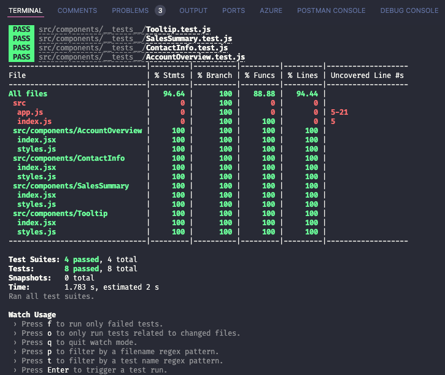

# Feefo: 2. UI Technical Assessment

Implement the design provided in `design.png` as a set of React components.

There is a stub for the data structure in `app.js`. Please use this to drive the view content and derive any calculated data from this in your components. The container component has also been created `AccountOverview` `./src/account-overview.jsx`.

## We would like to see
- The layout should grow/shrink sensibly with the viewport
- The design split into several components
- Usage of `proptypes`
- Unit tests covering your components
- a11y considered and relevant ARIA attributes added

## Technical Notes
- Assets for the font in the design (roboto) have been included via google fonts
- Font Awesome icons are available via the Font Awesome React bindings (there is a usage example in `account-overview.jsx`)
- The repository is set up to work with `styled-components` if you feel comfortable doing so, please use this instead of css
- The repository is set up to use jest + testing library for unit tests

## Setup
1. Run `npm install` to install required dependencies
2. Run `npm run start` to start a local development server

## Available Scripts

In the project directory, you can run:

### `npm start`

Runs the app in the development mode.\
Open [http://localhost:3000](http://localhost:3000) to view it in the browser.

The page will reload if you make edits.\
You will also see any lint errors in the console.

### `npm test`

Launches the test runner in the interactive watch mode.\
See the section about [running tests](https://facebook.github.io/create-react-app/docs/running-tests) for more information.

## Implemented UI

The implementation follows a mobile-first approach, ensuring the design is initially optimized for mobile devices and progressively enhanced for larger screens.

### Large Screen View

The following screenshot illustrates how the UI design appears on larger screens, showcasing the layout and components as per the provided design specifications.

  

    
  

### Mobile Screen View

Below is a screenshot demonstrating the responsive adaptation of the UI design for mobile devices. This view ensures that the layout remains functional and visually appealing on smaller screens.

  

    
  

## Test Coverage

The image below displays the test coverage report for the implemented React components. It shows the percentage of code covered by unit tests, ensuring robustness and reliability across the application.

  

    
  

