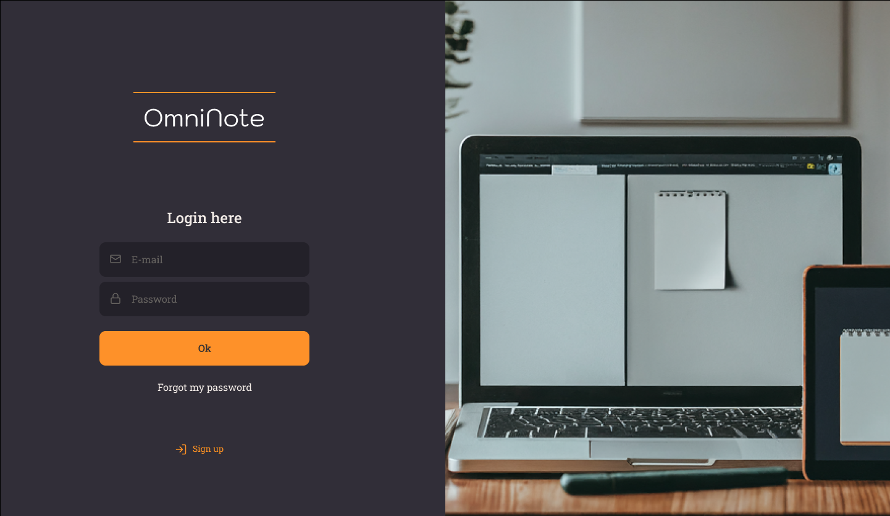
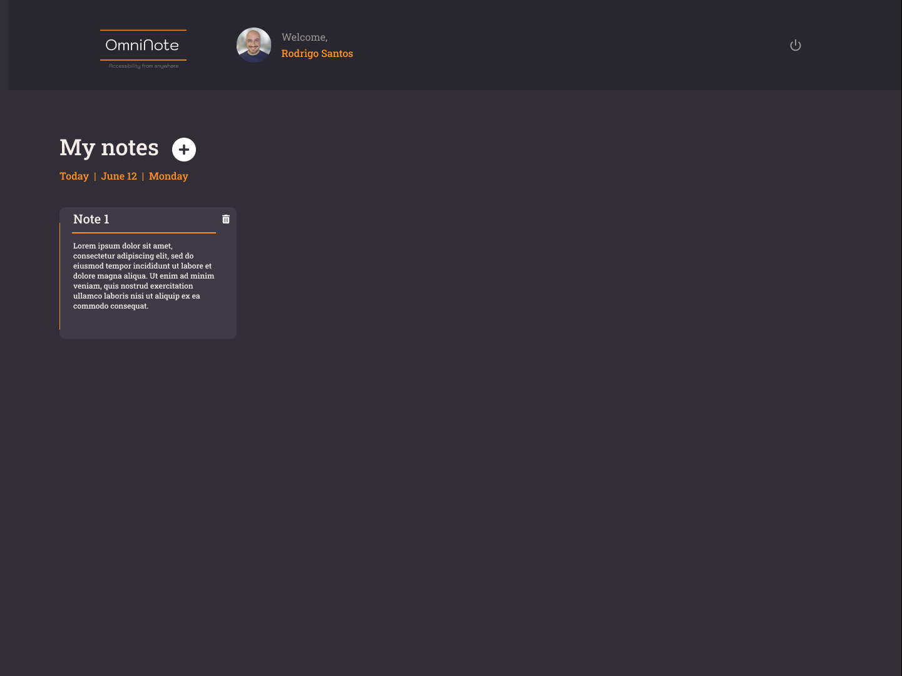
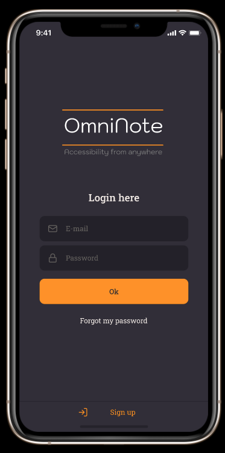
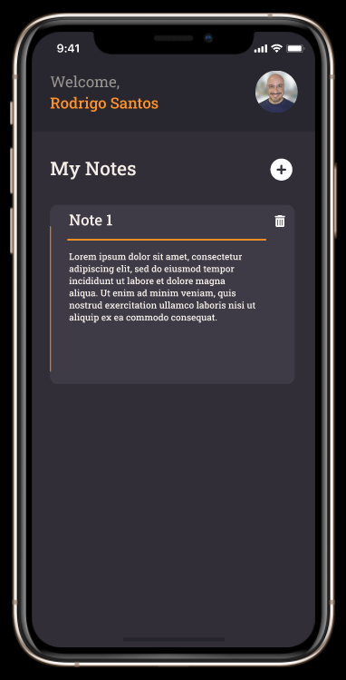

# Feefo: 3. Web App Restful API System Design

## OmniNote System Architecture

This document outlines the architecture of the OmniNote system, designed to provide a scalable, secure, and efficient solution for managing user interactions and data. The architecture leverages various AWS services, such as Amazon Cognito, API Gateway, EC2, SQS, and Lambda, to handle authentication, request routing, business logic execution, and asynchronous processing. However, the design is flexible and could be implemented using equivalent services from other cloud providers.

  <p align="center">
    
  </p>

1. **Authentication**
   - The authentication process is initiated by the client (user) when trying to access the application. Authentication is managed by Amazon Cognito, which authenticates the user and issues a JWT (JSON Web Token) for use in subsequent requests.

2. **Cognito**
   - Amazon Cognito is used to manage user authentication and authorization. It issues JWT tokens after successful authentication, which are used to authenticate requests to the backend.

3. **JWT**
   - The JWT (JSON Web Token) is used to authenticate requests to the backend. It is sent by the client along with the HTTP requests to validate the user's identity.

4. **Requests**
   - Authenticated requests are sent from the client (front-end) to the API Gateway. The JWT token is included in the requests to verify the user's authentication.

5. **API Gateway**
   - The API Gateway acts as the entry point for all client requests. It verifies the JWT token, routes requests to the appropriate backend services, and serves as an intermediary to manage incoming traffic.

6. **Load Balancer**
   - The Load Balancer distributes incoming requests among multiple EC2 instances. This ensures that the workload is evenly distributed, improving the system's scalability and availability.

7. **EC2**
   - EC2 (Elastic Compute Cloud) instances execute the business logic and process the received requests. They connect to databases to read/write data as needed and also interact with message queue services for asynchronous processing.

8. **MQ (Message Queue)**
   - EC2 instances write messages to message queues (MQ) for asynchronous processing. These queues can be managed by services such as Amazon SQS (Simple Queue Service) or other messaging systems that support the MQ standard. This mechanism allows decoupling the production of messages from their consumption, improving the application's scalability and resilience.

9. **Lambda Function**
   - Lambda functions can be invoked to perform specific tasks or asynchronous processing. They are often used for tasks that do not need to be executed in real-time or for background processing. They can be triggered by messages in the MQ queue.

10. **WebSocket API**
    - The WebSocket API allows real-time, bidirectional communication between the client and the server. It is used for functionalities requiring real-time updates, such as instant notifications or chat.

## 2. Web App UI

Wireframes for the OmniNote application have been created in Figma to illustrate the design and user interface for both desktop and mobile versions. These wireframes provide a visual guide to the layout and functionality of the application.

- [Desktop Wireframe](https://www.figma.com/proto/sIDlleXggz6VVyADrdFaHn/OmniNote?node-id=34-1181&t=udXBgVmPxnZi3GQg-1&scaling=min-zoom&content-scaling=fixed&page-id=34%3A1180&starting-point-node-id=34%3A1181) 

  <p align="center">
    
  </p>

  <p align="center">
    
  </p>

- [Mobile Wireframe](https://www.figma.com/proto/sIDlleXggz6VVyADrdFaHn/OmniNote?node-id=8517-288&t=OAIUpZ2WwsrOcbAz-1&scaling=scale-down&content-scaling=fixed&page-id=0%3A1&starting-point-node-id=8517%3A288)

  <p align="center">
    
    
  </p>

### UI Components and Interactions

#### 1. Logon Screen
- **Components**:
  - Username input field
  - Password input field
  - Login button
  - Link to Register screen

- **Interactions**:
  - Users enter their credentials (username and password) and click the Login button.
  - If the credentials are correct, the user is redirected to the Profile screen.
  - If the credentials are incorrect, an error message is displayed.
  - Users can navigate to the Register screen if they don't have an account.

#### 2. Register Screen
- **Components**:
  - Username input field
  - Email input field
  - Password input field
  - Confirm password input field
  - Register button

- **Interactions**:
  - Users enter their registration details and click the Register button.
  - If the details are valid, the user is registered and redirected to the Profile screen.
  - If the details are invalid, an error message is displayed.

#### 3. Profile Screen
- **Components**:
  - Profile picture
  - Username display
  - Email display
  - Edit profile button

- **Interactions**:
  - Users can view their profile information.
  - Users can click the Edit profile button to update their profile details.

#### 4. Dashboard Screen(s)
- **Components**:
  - Navigation bar
  - "My notes" section
  - Create new note button
  - List of existing notes
  - Note editing area (in some dashboard variants)
  - Save note button (in some dashboard variants)

- **Interactions**:
  - Users can navigate between different sections using the navigation bar.
  - Users can create new notes by clicking the Create new note button.
  - Users can view and edit existing notes.
  - Users can save changes to notes by clicking the Save note button.

### Validation Requirements

#### Logon Screen
- **Username and Password**:
  - Ensure both fields are filled before allowing submission.
  - Validate that the username exists and the password matches the stored password.

#### Register Screen
- **Username**:
  - Check for uniqueness (no duplicate usernames).
  - Ensure the username meets character requirements (e.g., no special characters, length restrictions).

- **Email**:
  - Validate the email format (e.g., using a regular expression).
  - Ensure the email is unique (no duplicate email addresses).

- **Password**:
  - Ensure the password meets complexity requirements (e.g., minimum length, contains numbers and special characters).
  - Confirm that the password and confirm password fields match.

#### Profile Screen
- **Profile Updates**:
  - Validate any changes to the username and email as per the registration validation rules.

#### Dashboard Screen(s)
- **Note Creation and Editing**:
  - Ensure the note content is not empty before allowing saving.
  - Optional: Validate the length of the note content to prevent excessively large notes.

## 3. Data Model

#### Note Model
A note in the OmniNote application will be represented by the following data model. This model outlines the necessary properties and their descriptions to ensure that all essential information about a note is captured and stored effectively.

#### Properties

1. **id**
   - **Type**: UUID (Universally Unique Identifier)
   - **Description**: A unique identifier for the note, ensuring that each note can be uniquely distinguished from others.
   - **Example**: `123e4567-e89b-12d3-a456-426614174000`

2. **title**
   - **Type**: String
   - **Description**: The title of the note, providing a brief summary or headline for the content of the note.
   - **Example**: `Meeting Notes`

3. **content**
   - **Type**: Text
   - **Description**: The main content of the note, which can include text, formatting, and possibly embedded media.
   - **Example**: `Discussed project timelines and deliverables. Key points include...`

4. **created_at**
   - **Type**: DateTime
   - **Description**: The timestamp indicating when the note was created.
   - **Example**: `2024-06-16T10:15:30Z`

5. **updated_at**
   - **Type**: DateTime
   - **Description**: The timestamp indicating the last time the note was updated.
   - **Example**: `2024-06-16T15:22:10Z`

#### Example Note Object

```json
{
  "id": "123e4567-e89b-12d3-a456-426614174000",
  "title": "Meeting Notes",
  "content": "Discussed project timelines and deliverables. Key points include...",
  "created_at": "2024-06-16T10:15:30Z",
  "updated_at": "2024-06-16T15:22:10Z"
}
```

## 4. Restful API

The Restful API for the OmniNote application provides endpoints for managing user notes. These endpoints allow the web app to perform CRUD (Create, Read, Update, Delete) operations on notes.

#### Examples:

- **GET /api/notes**
  - Retrieves a list of all notes for the authenticated user.
  - **Example**: `GET /api/notes`

- **GET /api/notes/:id**
  - Retrieves a specific note by its ID.
  - **Example**: `GET /api/notes/123e4567-e89b-12d3-a456-426614174000`

- **POST /api/notes**
  - Creates a new note.
  - **Example**: `POST /api/notes`
  - **Request Body**:
    ```json
    {
      "title": "Meeting Notes",
      "content": "Discussed project timelines and deliverables"
    }
    ```

- **PUT /api/notes/:id**
  - Updates an existing note by its ID.
  - **Example**: `PUT /api/notes/123e4567-e89b-12d3-a456-426614174000`
  - **Request Body**:
    ```json
    {
      "title": "Updated Meeting Notes",
      "content": "Updated content here..."
    }
    ```

- **DELETE /api/notes/:id**
  - Deletes a specific note by its ID.
  - **Example**: `DELETE /api/notes/123e4567-e89b-12d3-a456-426614174000`

## 5. Web Server

The webserver will be implemented using Spring Boot, a framework that simplifies the development of RESTful web services in Java. Each endpoint will be mapped to a specific controller method that processes the request and interacts with the database.

#### Actions

- **GET /api/notes**
  - **Implementation**: Retrieve all notes for the authenticated user from the database.
  - **Business Logic**: Ensure the user is authenticated and authorized to access the notes. Fetch notes from the database and return them in the response.

- **GET /api/notes/:id**
  - **Implementation**: Retrieve the note by its ID from the database.
  - **Business Logic**: Ensure the user is authenticated and authorized to access the note. Fetch the note from the database and return it in the response.

- **POST /api/notes**
  - **Implementation**: Create a new note in the database with the provided data.
  - **Business Logic**: Validate the input data (e.g., title and content should not be empty). Save the note to the database and return the newly created note in the response.

- **PUT /api/notes/:id**
  - **Implementation**: Update the note in the database with the provided data.
  - **Business Logic**: Validate the input data and ensure the user is authorized to update the note. Update the note in the database and return the updated note in the response.

- **DELETE /api/notes/:id**
  - **Implementation**: Delete the note from the database.
  - **Business Logic**: Ensure the user is authorized to delete the note. Remove the note from the database and return a confirmation response.


#### Database

- Notes will be saved in a database. This can be a relational database (e.g., PostgreSQL) or a NoSQL database (e.g., MongoDB).
